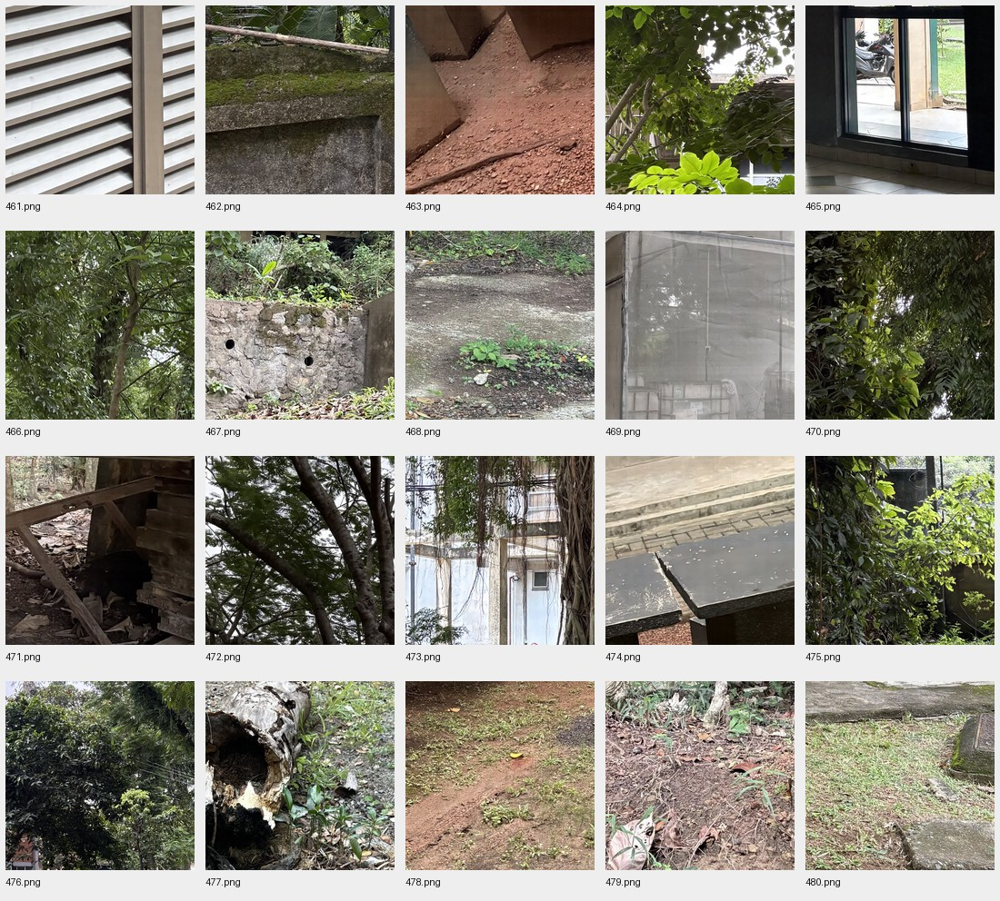

# Final denoised image list

20 RGB PNG images, each 992 × 992, generated from width 128 / 20,000-step EMA / mild threshold 0.03 using CUDA.

Download `VISION_HUNTERS.zip` from the GitHub release for the image-only competition archive. All files are also in [images](images).

No clean preliminary targets are supplied; no quality score is claimed for these 20 images.

| Noisy input | Denoised output | Bytes | SHA-256 |
|---|---|---:|---|
| 461_noise.png | [461.png](images/461.png) | 937,388 | `4ea0da82d1561dd59a7dc0dac22a4ad14e37c25dd5c326dbba0bf20582d5483e` |
| 462_noise.png | [462.png](images/462.png) | 1,516,142 | `b3af0b6a0d4ed7696df1d2d481486221868a41c31a0abad65481ea7be9e9ed3f` |
| 463_noise.png | [463.png](images/463.png) | 1,288,680 | `1058b68e2f5287bf0fdd514b55529403674e98304d29c0b6d2f6af9eed356fe0` |
| 464_noise.png | [464.png](images/464.png) | 1,416,569 | `cf50f68b3b60a31b87e9c5b6c93c092bbeb4acd01e5a5f1ab77d7ecec55dcd7e` |
| 465_noise.png | [465.png](images/465.png) | 1,102,551 | `67faaa65e3000f6594942c1100f69d8c088faaa34134671ab2691e6d736e8f1b` |
| 466_noise.png | [466.png](images/466.png) | 1,778,150 | `b5f97d428f3a7cb54e73e55d50aae39582287c8ffebdd5cae548e8f75c0a4a63` |
| 467_noise.png | [467.png](images/467.png) | 1,855,697 | `77d73a9a2e33bbecbe7e2cbd500b01ff74bee3c2fa554b1be77209b2b4b25fe8` |
| 468_noise.png | [468.png](images/468.png) | 1,791,633 | `b70d5deae8602f53d686ab0150aad93f41ef3c8a4ca1a5f951f340a89daa5f22` |
| 469_noise.png | [469.png](images/469.png) | 926,897 | `46f72fa8e900ae27707e413a4e73dcc6a74b4abc23bbb509bc975c3d19618e6f` |
| 470_noise.png | [470.png](images/470.png) | 1,471,507 | `b62cc5998556ea264bd52d77d6b35097831a8bf8a73f67a74f6f814bad74c93b` |
| 471_noise.png | [471.png](images/471.png) | 1,207,983 | `07c93e9393dad29f5ff9920d75cd453bec25698f2166d0867510c07b1072e388` |
| 472_noise.png | [472.png](images/472.png) | 1,618,769 | `2b471592e8ccfa4bbba7fcdf8270367c30614c989ebcb0fbd833cd49996dbd20` |
| 473_noise.png | [473.png](images/473.png) | 1,621,408 | `c26e9bbe315f1eb1f872f552e6276879cdd2b23c4eb8b5f418c9e38af6991b03` |
| 474_noise.png | [474.png](images/474.png) | 1,053,419 | `05faf88dfcda8fe083e7ac140bfd8286645c4061e62f939736e1c9559b2f05ec` |
| 475_noise.png | [475.png](images/475.png) | 1,686,132 | `b6d8a811a79e121c49c74eb0532f8bc18b82055bb78ec3e56dfc297647dbd0c8` |
| 476_noise.png | [476.png](images/476.png) | 2,064,746 | `79241e75536e0c8e09ba6856c924798fc7b6cae6590dec03081871df4a1253e0` |
| 477_noise.png | [477.png](images/477.png) | 1,714,128 | `eff76470086db9594c317575e43dd251720aa73fa66a90ac6af8789134b8ba6f` |
| 478_noise.png | [478.png](images/478.png) | 1,922,962 | `98acbab741ea4c3234a2478ff39d171226e9726dd95a214781e00b5325d75412` |
| 479_noise.png | [479.png](images/479.png) | 1,872,717 | `d5c53d9573b9b951c67b033c4c2107ba85614af6eaddc0a60c30dd1199ae4871` |
| 480_noise.png | [480.png](images/480.png) | 1,945,427 | `caf81e340154d7c658d9bdab514aa468da1ce3a5e2fd97e9d772d1848c457787` |

Total PNG bytes: 30,792,905. ZIP bytes: 30,804,119.
ZIP SHA-256: `7f939c8f9b8001ad7c7934495a7ce5ebc6d2fe81f311d0544c735e2fca03d592`.

[Inference manifest](inference_manifest.json) · [Submission manifest](submission_manifest.json) · [Runtime checks](runtime_checks.json)
